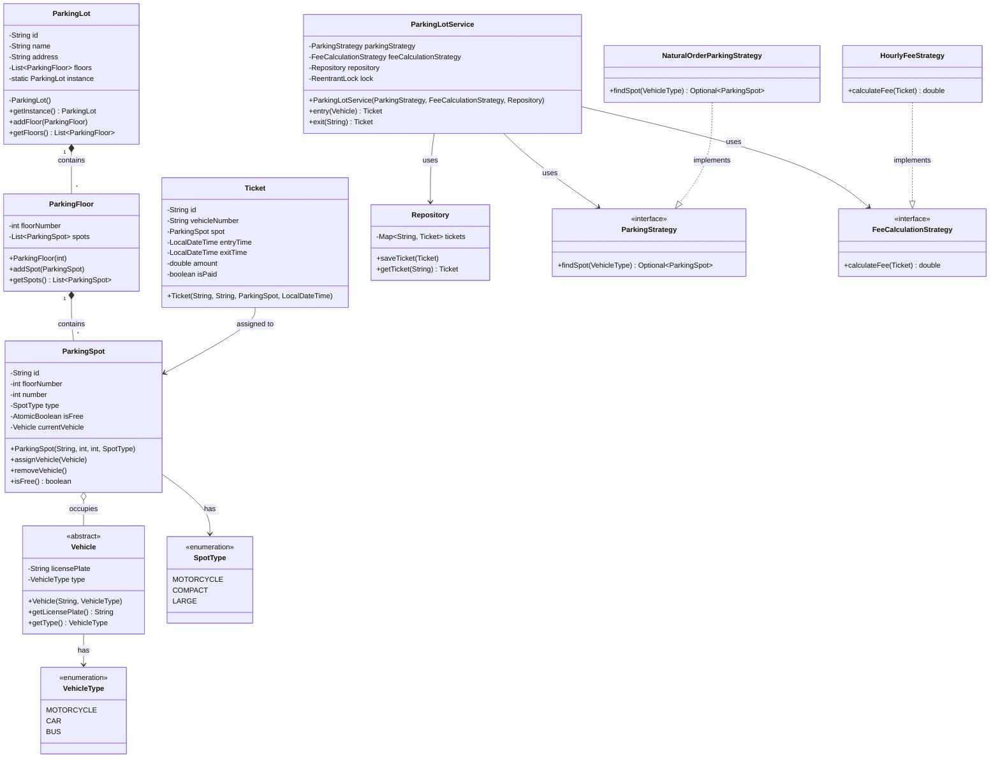

# Smart Parking Lot System

## Class Diagram

```mermaid
classDiagram
    class ParkingLot {
        -String id
        -String name
        -String address
        -List~ParkingFloor~ floors
        -static ParkingLot instance
        -ParkingLot()
        +getInstance() ParkingLot
        +addFloor(ParkingFloor)
        +getFloors() List~ParkingFloor~
    }

    class ParkingFloor {
        -int floorNumber
        -List~ParkingSpot~ spots
        +ParkingFloor(int)
        +addSpot(ParkingSpot)
        +getSpots() List~ParkingSpot~
    }

    class ParkingSpot {
        -String id
        -int floorNumber
        -int number
        -SpotType type
        -AtomicBoolean isFree
        -Vehicle currentVehicle
        +ParkingSpot(String, int, int, SpotType)
        +assignVehicle(Vehicle)
        +removeVehicle()
        +isFree() boolean
    }

    class Vehicle {
        <<abstract>>
        -String licensePlate
        -VehicleType type
        +Vehicle(String, VehicleType)
        +getLicensePlate() String
        +getType() VehicleType
    }

    class Ticket {
        -String id
        -String vehicleNumber
        -ParkingSpot spot
        -LocalDateTime entryTime
        -LocalDateTime exitTime
        -double amount
        -boolean isPaid
        +Ticket(String, String, ParkingSpot, LocalDateTime)
    }

    class ParkingLotService {
        -ParkingStrategy parkingStrategy
        -FeeCalculationStrategy feeCalculationStrategy
        -Repository repository
        -ReentrantLock lock
        +ParkingLotService(ParkingStrategy, FeeCalculationStrategy, Repository)
        +entry(Vehicle) Ticket
        +exit(String) Ticket
    }

    class Repository {
        -Map~String, Ticket~ tickets
        +saveTicket(Ticket)
        +getTicket(String) Ticket
    }

    class ParkingStrategy {
        <<interface>>
        +findSpot(VehicleType) Optional~ParkingSpot~
    }

    class FeeCalculationStrategy {
        <<interface>>
        +calculateFee(Ticket) double
    }

    class NaturalOrderParkingStrategy {
        +findSpot(VehicleType) Optional~ParkingSpot~
    }

    class HourlyFeeStrategy {
        +calculateFee(Ticket) double
    }

    class VehicleType {
        <<enumeration>>
        MOTORCYCLE
        CAR
        BUS
    }

    class SpotType {
        <<enumeration>>
        MOTORCYCLE
        COMPACT
        LARGE
    }

    %% Relationships
    ParkingLot "1" *-- "*" ParkingFloor : contains
    ParkingFloor "1" *-- "*" ParkingSpot : contains
    ParkingSpot o-- Vehicle : occupies
    ParkingSpot --> SpotType : has
    Vehicle --> VehicleType : has
    
    ParkingLotService --> Repository : uses
    ParkingLotService --> ParkingStrategy : uses
    ParkingLotService --> FeeCalculationStrategy : uses
    
    NaturalOrderParkingStrategy ..|> ParkingStrategy : implements
    HourlyFeeStrategy ..|> FeeCalculationStrategy : implements
    
    Ticket --> ParkingSpot : assigned to
```
